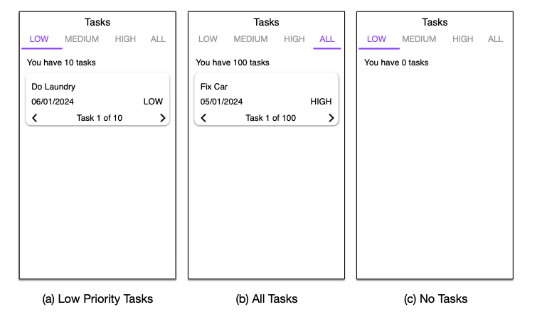

# Track Task Mobile Application  

## 📌 Overview  
Track Task is an Android mobile application that helps users organize and view their tasks based on priority. The app uses **ViewPager2** and **TabLayout** to categorize tasks into **LOW**, **MEDIUM**, **HIGH**, and **ALL** priorities. It features a single **Main Activity** and multiple **Fragments**, with all communication managed centrally through the Main Activity.  

---

## 🚀 Features  
- **Task Management by Priority**  
  - Tasks are categorized into **LOW**, **MEDIUM**, **HIGH**, and **ALL**.  
  - Users can switch between categories using **tabs** or by **swiping**.  

- **Main Activity**  
  - Hosts the **ViewPager2** and **TabLayout**.  
  - Implements **FragmentStateAdapter** and **TabLayoutMediator**.  
  - Passes a filtered list of tasks to each Tasks Fragment based on selected priority.  

- **Tasks Fragment**  
  - Displays tasks passed from the Main Activity.  
  - Tasks are **sorted by date (descending order)**.  
  - Shows the **total number of tasks** at the top.  
  - Provides task navigation with **previous (<)** and **next (>)** buttons:  
    - If the user reaches the last task and presses ">", it loops back to the first task.  
    - If the user is on the first task and presses "<", it loops back to the last task.  
  - Displays **task number** (e.g., *Task 1 of 10*).  
  - Shows an **empty state view** if no tasks are available.  

---

## 🛠️ Technical Details  
- **Language:** Java/Kotlin (depending on your implementation)  
- **Architecture:** Single-Activity with multiple Fragments  
- **UI Components:**  
  - ViewPager2  
  - TabLayout  
  - FragmentStateAdapter  
  - TabLayoutMediator  
- **Data Handling:**  
  - Task list stored in `ArrayList<Task>` in Main Activity  
  - Pre-populated tasks provided by **DataStore class**  
  - Fragment receives filtered task list through Main Activity  

---

## 📷 App Wireframe (From Requirements)  
- **LOW Priority View**  
- **ALL Tasks View**  
- **Empty Tasks View**  

---

## 📂 Project Structure  
```text
/TrackTaskApp
├── MainActivity.java (hosts ViewPager2 & TabLayout)
├── TaskFragment.java (displays tasks)
├── adapters/
│ └── TaskPagerAdapter.java
├── data/
│ └── DataStore.java (provides pre-populated tasks)
├── models/
│ └── Task.java
└── res/
├── layout/
│ ├── activity_main.xml
│ └── fragment_task.xml
└── values/
└── strings.xml
```


---

## 📖 How It Works  
1. **App launches → MainActivity** loads ViewPager2 and TabLayout.  
2. **Tabs (LOW, MEDIUM, HIGH, ALL)** created with TabLayoutMediator.  
3. Selecting a tab or swiping → loads corresponding **Tasks Fragment**.  
4. Fragment receives filtered task list, sorts it by date, and displays tasks.  
5. User navigates between tasks using `<` and `>` buttons.  

---

## ✅ Requirements Fulfilled  
- [x] Single Activity with multiple Fragments  
- [x] Central communication through Main Activity  
- [x] Tasks categorized by priority (LOW, MEDIUM, HIGH, ALL)  
- [x] Tasks sorted by date (descending order)  
- [x] Task navigation with looping behavior  
- [x] Empty view when no tasks are available  

---

## 📦 Installation & Running  
1. Clone or download the project.  
2. Open in **Android Studio**.  
3. Build and run on an **Android Emulator** or physical device.  

---

## App Preview


<div align="center">
<p>

</p>
<br>  
</div>
